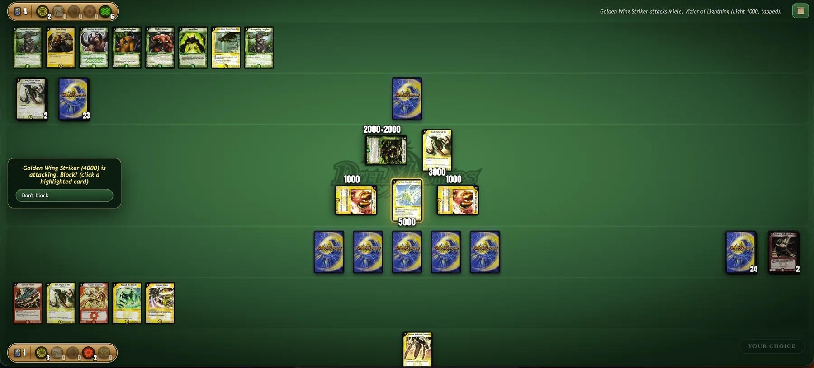

# Duel Masters

Original duel masters game now playable in your browser against any LLM.
I saw that they had gameboy and another reboots of the game too, but I wanted personalised cards and was fine wihtout the other bells and whistles and so made this for my own pleasure. 

## Playing

Drag a card to your mana zone to charge it, to your battle zone to summon or
cast, and drag a creature onto an enemy creature or their shields to attack.
Click any card to read it full size. 📜 opens the log.

## How it works

The whole game is one Python generator. It runs until somebody has to choose
something, then yields a decision with every legal option enumerated. The browser and the LLM opponent both just
answer decisions, so any model that can return JSON can play and the AI gets
a tactical brief with the combat arithmetic already solved, because without it
models pass their turn with mana unspent and miss wins on board.

Card data and art come from [db.duelmasters.us](https://db.duelmasters.us/) and
remain Wizards / Takara Tomy IP. 
